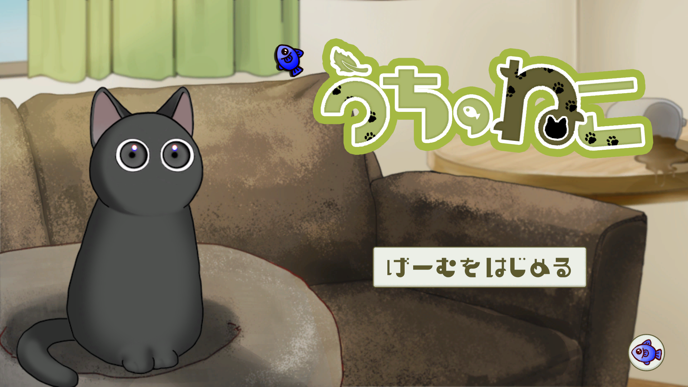
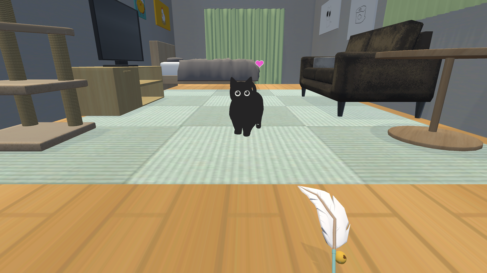

# 「うちのねこ」

## ファイル構成  
* [Unityデータ](./ProjectData)  
* [ビルドデータ](./Build)

## ゲーム概要  

### ジャンル  
ねこちゃん戯れ癒されシミュレーター

### ゲームルール  
ねこに興味を持ってもえるようにねこじゃらしを振って飛びついてくれたら終了の短時間で遊べるミニゲームとなっています  
ねこじゃらしの振り方が毎回異なっていたり、リザルト画面が5段階式で様々なねこちゃんが見られるので  
ぜひ繰り返し遊んでいろんなねこちゃんに癒されてみてください  
（隠れた小ネタや遊びがあるので探してみるのもいいかも…）  

### プラットフォーム  
* [ビルドデータ_windows](./Build/UchinoNeko_Windows)  

### Unityバージョン  
Unity 2022.3.24f1

## 担当ブログラムファイル  
* [ねこ疑似AI](./ProjectData/Assets/2_MainScene/Scripts/Cat/CatAi.cs)

## 制作概要  
### メンバー（役割）  
* 内間 乙樹（プログラマー）  
* 新垣 大空（プログラマー）  
* 座覇 雛妃（デザイナー）  
* 嘉手苅 陽凪（デザイナー）

### 制作期間
３か月

## ゲームスクリーンショット  
  
  

