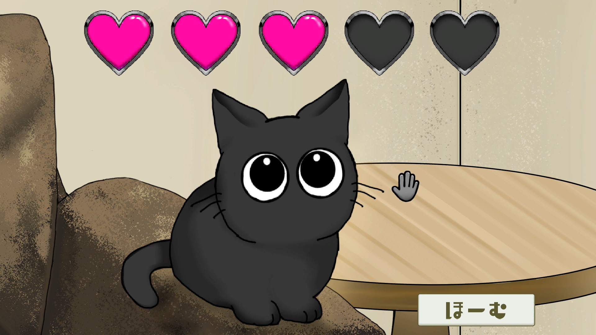

# 「うちのねこ」

## ファイル構成  
* [Unityデータ](./ProjectData)  
* [ビルドデータ](./Build)

## ゲーム概要  

### ジャンル  
ねこちゃん戯れ癒されシミュレーター

### ゲームルール  
上手くねこじゃらしを振ってねこちゃんが飛びついてくれたら終了の短時間で遊べるミニゲームとなっています  
ねこじゃらしの振り方が毎回異なっていたり、リザルト画面が5段階式で様々なねこちゃんが見られるので  
ぜひ繰り返し遊んでいろんなねこちゃんに癒されてみてください  
（隠れた小ネタや遊びがあるので探してみるのもいいかも…）  

### プラットフォーム  
* Windows [ビルドデータ](./Build/UchinoNeko_Windows)  

### Unityバージョン  
Unity 2022.3.24f1

## 担当ブログラム 
### こだわったスクリプト
* [ねこ疑似AI](./ProjectData/Assets/2_MainScene/Scripts/Cat/CatAi.cs)
* [ねこの動き](./ProjectData/Assets/2_MainScene/Scripts/Cat/CatMove.cs)
* [ねこじゃらしの動き(形)を検知](./ProjectData/Assets/2_MainScene/Scripts/CatPlay/CatPlayMove.cs)
  
### 担当スクリプト一覧
* [TitleScene全般](./ProjectData/Assets/1_TitleScene/Scripts)
* [MainScene全般](./ProjectData/Assets/2_MainScene/Scripts)

### 苦労・工夫
ねこちゃんにプログラムで動いているという感覚になってほしくなかったため、  
理不尽過ぎない程度にランダム性をちりばめることや、計算をしてできる限り滑らかに動かす事に苦労しました  
強く没入感を持ってもらいたかったため、ゲーム中のUI表示をできるだけ減らしたり、  
ねこじゃらしにしなりや慣性を付けてより現実味が増すようにするなどの工夫もしました

## 制作概要  
### メンバー（役割）  
* 内間 乙樹（プログラマー）  
* 新垣 大空（プログラマー）  
* 座覇 雛妃（デザイナー）  
* 嘉手苅 陽凪（デザイナー）

### 制作期間
３か月

## プレイ動画＆スクリーンショット  

  
  

